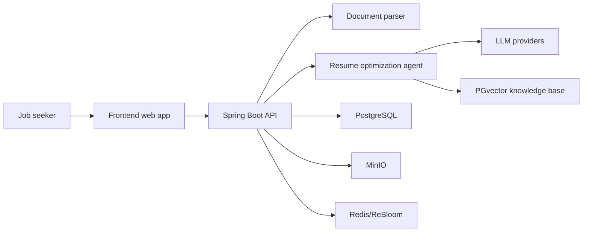
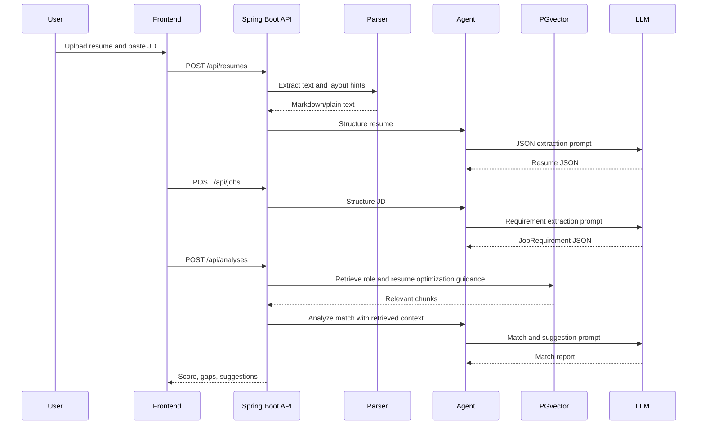

# Architecture

## Product Goal

Build an intelligent resume optimization platform for job seekers.

Users upload an original resume and provide a target job description. The system parses both documents, matches resume evidence against role requirements, identifies missing or weak areas, and provides either actionable suggestions or rewritten resume sections.

## Reference Project

The copied reference project at `参考/Resume-Matcher` provides useful product patterns:

- Resume upload and parsing
- Job description upload
- Tailored resume generation
- JD match comparison
- Resume builder and PDF export
- LLM provider configuration
- Multi-page frontend workflow

This rewrite should keep the product direction but rebuild the backend around Java and Spring AI.

## System Context



## Backend Modules

```text
backend/src/main/java/com/resumeai/
  interfaces/       # REST, SSE, request/response DTOs
  application/      # Use cases and orchestration services
  domain/           # Domain models and domain services
  infrastructure/   # JPA, PGvector, Redis, MinIO, parsers, LLM adapters
  agent/            # Spring AI prompts, tools, RAG, advisors, workflows
```

### Interfaces Layer

Owns transport concerns only:

- REST controllers
- SSE endpoints for streaming analysis and rewrite progress
- Validation of request DTOs
- OpenAPI annotations
- Error response mapping

### Application Layer

Coordinates use cases:

- Upload resume
- Parse resume
- Upload job description
- Analyze resume-to-job match
- Generate suggestions
- Rewrite selected sections
- Export optimized resume
- Manage knowledge base documents

### Domain Layer

Contains project vocabulary:

- `Resume`
- `ResumeSection`
- `JobDescription`
- `JobRequirement`
- `MatchReport`
- `Suggestion`
- `RewriteDraft`
- `KnowledgeDocument`

Domain objects should not depend on Spring AI or persistence classes.

### Infrastructure Layer

Implements external capabilities:

- PostgreSQL persistence
- PGvector vector search
- MinIO file storage
- Redis cache and future ReBloom dedupe
- Apache Tika/PDFBox/docx4j parsing
- LLM provider configuration
- PDF/DOCX export

### Agent Layer

Owns AI-specific logic:

- Prompt templates
- Spring AI `ChatClient`
- RAG advisors
- Tool calling
- Structured output conversion
- LLM evaluation and retry policy

## Core Workflow



## RAG Design

RAG should strengthen resume improvement quality instead of existing just to satisfy a requirement.

Recommended knowledge sources:

- Resume writing rules: STAR method, quantified achievements, ATS guidelines
- Role libraries: common requirements for Java, frontend, data, AI, product roles
- Company or industry notes: optional future source
- User resume history: optional future source for style consistency

Recommended vector table:

```text
document_chunks
  id
  document_id
  document_type
  source_type
  source_id
  title
  content
  metadata_json
  embedding vector
  created_at
```

Suggested `document_type` values:

- `RESUME`
- `JOB_DESCRIPTION`
- `RESUME_GUIDE`
- `ROLE_GUIDE`
- `COMPANY_PROFILE`
- `OPTIMIZATION_RULE`

## Agent and Tool Design

Start with one orchestrating agent and multiple tools. This keeps behavior observable and easier to debug than a premature multi-agent system.

Initial agent:

- `ResumeOptimizationAgent`

Initial tools:

- `parseResumeTool`
- `parseJobDescriptionTool`
- `retrieveResumeGuideTool`
- `calculateMatchScoreTool`
- `rewriteExperienceBulletTool`
- `verifyRewriteFaithfulnessTool`
- `generateExportFileTool`

Future specialized agents:

- Parser Agent
- Match Agent
- Resume Coach Agent
- Rewrite Agent
- Verifier Agent

## Data Flow Boundaries

Store raw files in MinIO. Store structured business entities in PostgreSQL. Store embeddings in PostgreSQL PGvector. Use Redis for short-lived status/progress and future Bloom-filter dedupe where repeated indexing or duplicate uploads need cheap membership checks.

Do not store provider API keys in plaintext. Prefer environment variables for local development and encrypted storage for user-provided provider credentials if this becomes multi-user.

## Frontend Product Areas

Recommended pages:

- Dashboard: recent resumes, analyses, drafts
- Upload: resume upload and JD input
- Analysis: score, gaps, keywords, evidence mapping
- Rewrite Studio: side-by-side original and generated sections
- Resume Builder: structured resume editor and preview
- Knowledge Base: upload or manage RAG guidance documents
- Settings: model provider, local/cloud LLM options

## Non-Goals for MVP

- Full enterprise recruitment ATS
- Multi-tenant billing
- Browser plugin automation
- Fully autonomous job application submission
- Complex multi-agent framework before a single-agent tool workflow works well
